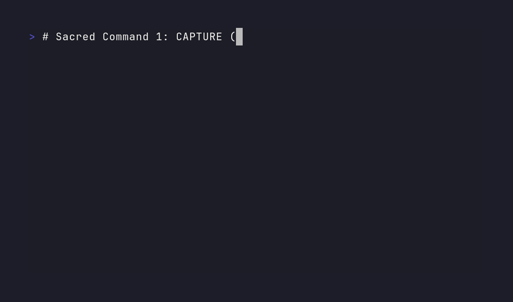
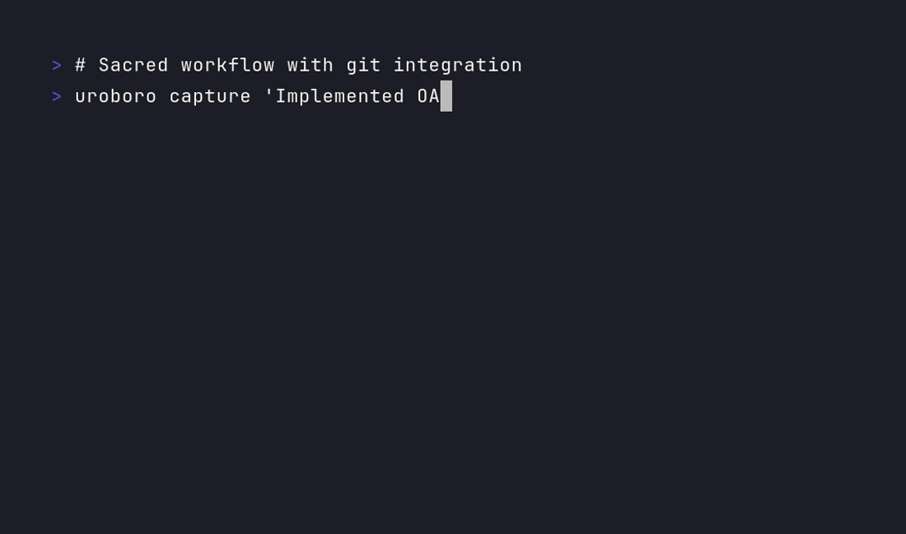
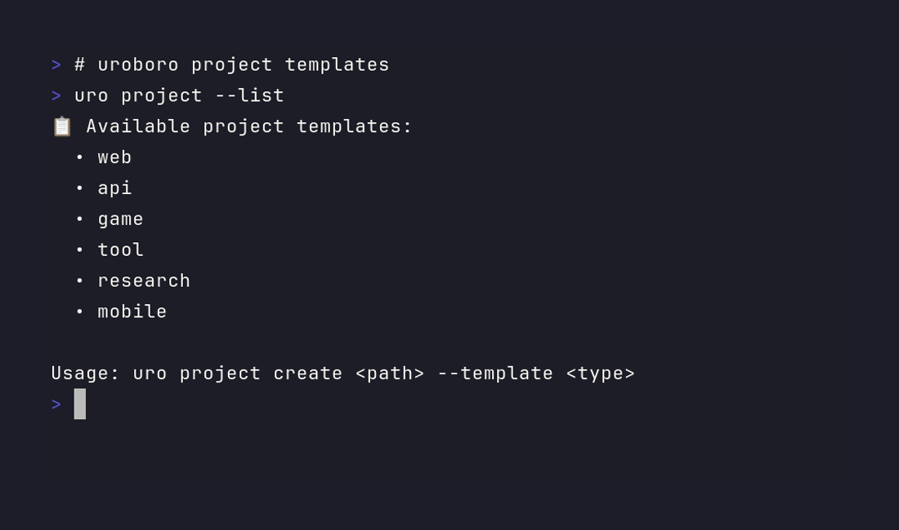

# uroboro 🐍

**The Self-Documenting Content Pipeline**

Transform your daily development work into polished blog posts, social media content, and technical documentation using **local AI only**. Zero API costs, maximum privacy.


*[View more demos](#-demos): [Core Workflow](assets/uroboro_demo_core.gif) • [Git Integration](assets/uroboro_demo_git.gif) • [Project Templates](assets/uroboro_demo_templates.gif)*

## ✨ Features

- **🏠 100% Local AI** - No API costs, no data sent to external servers
- **⚡ Unified CLI** - Single command interface for all functionality (`uro`)
- **📝 Smart Content Generation** - Blog posts, social media, technical docs
- **🎯 Multi-Project Tracking** - Organize captures across different projects
- **🔗 Git Integration** - Auto-capture commits with hooks and analyze patterns
- **📋 Project Templates** - Quick setup for new projects with AI context
- **🎨 Voice Training** - Learn your authentic writing style from existing content
- **🧠 Knowledge Mining** - Extract insights from your development history
- **🔒 Privacy-First** - Optional local-only usage tracking
- **📊 Development Analytics** - Track your growth and patterns over time

### 🚀 Core Features Deep Dive

#### ⚡ Smart Capture System
- **5-second captures** during development with zero flow interruption
- **Auto-tagging** and smart categorization of insights
- **Multi-project organization** across different codebases
- **Rich context** including git info, timestamps, and metadata
- **Cross-project pattern recognition** for better insights

#### 🔗 Seamless Git Integration
- **Auto-capture git commits** - Never miss development insights
- **Git hooks installation** - Zero-friction integration with your workflow
- **Commit pattern analysis** - Extract trends from your development history
- **Branch awareness** - Context-aware logging across feature branches
- **Repository insights** - Understand your coding patterns over time

#### 📋 AI-Optimized Project Templates
- **6 template types**: Web, API, Game, Tool, Research, Mobile
- **Pre-configured AI context** for better content generation
- **Project-specific configurations** including appropriate `.gitignore` files
- **Smart defaults** optimized for different development workflows
- **Quick start guides** to get productive immediately

#### 🎨 Authentic Voice Training
- **Personal voice extraction** from your existing markdown files and notes
- **Writing pattern analysis** including sentence structure, tone, and style
- **Recursive improvement** - gets better the more you use it
- **Multiple voice styles** available (Professional, Technical, Storytelling, etc.)
- **Anti-AI detection** - sounds like you, not generic AI content

#### 🧠 Knowledge Mining & Analytics
- **Cross-project insights** - find patterns across all your codebases
- **Learning trajectory tracking** - visualize your growth over time
- **Technical evolution documentation** - automatic skill development logs
- **Hidden connection discovery** - uncover unexpected relationships in your work
- **Development pattern analysis** - understand your productive rhythms

#### 🔒 Privacy-First Design
- **100% local processing** with Ollama - no external API calls
- **Zero data collection** - your code and insights stay on your machine
- **Optional usage statistics** stored locally in SQLite for your analysis
- **No telemetry or phone-home** functionality
- **Full data ownership** - export and analyze your own development patterns

---

## 🎬 Live Demos

### Core Workflow Demo

*The essential uroboro experience: `uro capture` → `uro status` → `uro generate`*

### Git Integration Demo  

*Install hooks, analyze patterns, auto-capture commits*

### Project Templates Demo

*Quick setup with AI-optimized configurations*

### Complete Feature Overview

*Complete walkthrough of all uroboro capabilities*

---

## 🚀 Quick Start

### 🎬 See It In Action First

Before diving into installation, see uroboro in action:

| Demo | What it shows | Duration |
|------|---------------|----------|
| [**🎯 Core Workflow**](assets/uroboro_demo_core.gif) | Essential capture → status → generate flow | 15s |
| [**🔗 Git Integration**](assets/uroboro_demo_git.gif) | Hook installation and commit analysis | 20s |
| [**📋 Project Templates**](assets/uroboro_demo_templates.gif) | Quick project setup with AI context | 25s |
| [**🎬 Complete Overview**](assets/uroboro_demo.gif) | Full feature tour and workflow | 45s |

### Installation

```bash
# Clone the repository
git clone https://github.com/qry91/uroboro
cd uroboro

# Install dependencies
pip install -e .

# Verify installation
uroboro --help
```

### Basic Usage

```bash
# Capture development insights (quick alias: uro)
uro capture "Fixed authentication bug in login flow"

# Capture with project and tags
uro capture "Implemented real-time notifications" --project my-app --tags feature websockets

# Generate content from recent activity
uro generate --blog --voice storytelling

# Check status
uro status

# Set up git auto-capture
uro git --hook-install
```

## 📋 Commands

### Core Commands

- **`uro capture`** - Capture development insights and progress
- **`uro generate`** - Generate blog posts, social content, documentation
- **`uro status`** - Show recent activity and system status
- **`uro voice`** - Analyze and train your writing voice

### Advanced Features

- **`uro git`** - Git integration for automatic commit capture
- **`uro project`** - Project template management
- **`uro mine`** - Knowledge base mining and analysis
- **`uro tracking`** - Privacy-first usage analytics

### Project Templates

Create new projects with optimal uroboro integration:

```bash
# List available templates
uro project --list

# Create a new web project
uro project create my-web-app --template web --name "My Web App"

# Available templates: web, api, game, tool, research, mobile
```

Each template includes:
- Pre-configured `.devlog/README.md` with AI instructions
- Appropriate `.gitignore` for the project type
- Initial capture file to get started

## 🎯 Workflow

### 1. Daily Development Capture

```bash
# During development - capture insights as they happen
uro capture "Discovered interesting pattern in React state management"
uro capture "Performance optimization reduced load time by 40%" --tags performance
```

### 2. Git Integration

```bash
# Install git hook for automatic commit capture
uro git --hook-install

# Or manually capture recent commits
uro git --capture-commits --days 3
```

### 3. Content Generation

```bash
# Generate blog post from recent activity
uro generate --blog --voice professional --days 7

# Create social media content
uro generate --social --voice storytelling

# Preview before saving
uro generate --preview --output all
```

### 4. Voice Training

```bash
# Analyze your writing style
uro voice

# Use your personal voice in generation
uro generate --voice personal_excavated
```

## 🏗️ Architecture

```
Daily Dev Work → Quick Capture → Local AI → Published Content
     ↓              ↓              ↓            ↓
  Git commits   .devlog files   Ollama LLM   Blog posts
  Code changes  Project notes   Local only   Social media
  Insights      Cross-project   Zero cost    Documentation
```

## 🎨 Writing Voices

uroboro supports multiple writing styles:

- **Professional** - Polished, conversational tone
- **Technical** - Deep technical explanations
- **Storytelling** - Narrative approach to development
- **Minimalist** - Concise, bullet-focused content
- **Thought Leadership** - Industry insights and bigger picture
- **Personal Excavated** - Your authentic voice (trained from your writing)

## 🔧 Configuration

### System Requirements

- **Python 3.8+**
- **Git** (for git integration features)
- **Ollama** (for local AI processing)
- **16GB+ RAM** recommended for local LLMs

### Privacy & Tracking

uroboro includes optional local-only usage tracking:

```bash
# Enable tracking (data never leaves your machine)
uro tracking --enable

# View statistics
uro tracking --stats

# Disable and clear data
uro tracking --disable
```

## 🧪 Testing

Run the test suite:

```bash
# Install test dependencies
pip install pytest pytest-cov

# Run tests
pytest tests/ -v

# Run with coverage
pytest tests/ --cov=src --cov-report=term-missing
```

## 🚀 Development

### Project Structure

```
uroboro/
├── src/                    # Core modules
│   ├── cli.py             # Unified CLI interface
│   ├── aggregator.py      # Content aggregation
│   ├── git_integration.py # Git hooks and analysis
│   ├── project_templates.py # Project scaffolding
│   ├── usage_tracker.py   # Privacy-first analytics
│   └── processors/        # Content generation
├── tests/                 # Test suite
├── landing-page/          # Project website
├── assets/               # Demo GIFs and media
└── examples/             # Usage examples
```

### Contributing

1. Fork the repository
2. Create a feature branch
3. Add tests for new functionality
4. Ensure all tests pass
5. Submit a pull request

### CI/CD

The project includes comprehensive GitHub Actions workflows:

- **Tests** - Multi-Python version testing
- **Integration Tests** - End-to-end CLI testing
- **Demo Generation** - Automated GIF creation with VHS
- **Linting** - Code quality checks

## 🌟 Examples

### Blog Post Generation

Input (captured over a week):
```bash
uro capture "Implemented user authentication with OAuth2"
uro capture "Fixed memory leak in WebSocket connections"
uro capture "Added real-time collaboration features"
```

Output:
```markdown
# Building Real-Time Features: A Week of Authentication and Performance

This week brought some interesting challenges in building robust real-time features. 
The journey from basic authentication to performant WebSocket connections taught me 
several important lessons about production-ready web applications...
```

### Git Integration

```bash
# Analyze your development patterns
uro git --analyze --days 30

# Output:
📊 Git Analysis Results:
  Total commits: 47
  
  Top commit keywords:
    fix: 12 times
    add: 8 times
    update: 6 times
    
  File types changed:
    .py: 23 files
    .md: 12 files
    .js: 8 files
```

## 🎬 Demos

### Core Workflow

*Capture → Status → Generate: The essential uroboro workflow*

### Git Integration  

*Auto-capture commits, analyze patterns, install hooks*

### Project Templates

*Quick project setup with AI-optimized templates*

### Full Feature Overview

*Complete walkthrough of uroboro capabilities*

## 📄 License

MIT License - see [LICENSE](LICENSE) for details.

## 🔗 Links

- **Website**: [uroboro.dev](https://uroboro.dev)
- **Documentation**: [GitHub Wiki](https://github.com/qry91/uroboro/wiki)
- **Issues**: [GitHub Issues](https://github.com/qry91/uroboro/issues)
- **Discussions**: [GitHub Discussions](https://github.com/qry91/uroboro/discussions)

---

*uroboro: The tool that documents itself while helping you document everything else* 🐍