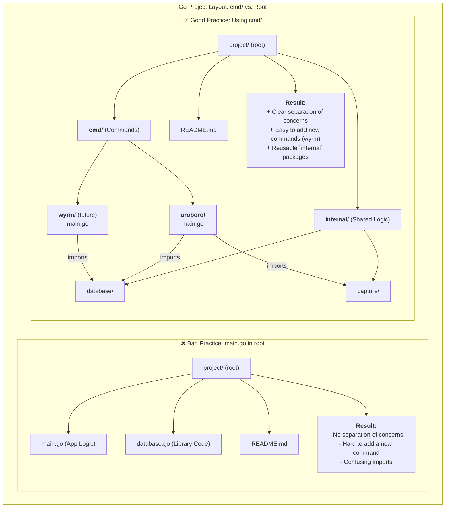

# Go Project Layout Philosophy

This document explains the reasoning behind uroboro's directory structure, specifically why the main application code is located in the `cmd/` directory instead of the project root.

## TL;DR: Scalability and Clarity

The current structure (`cmd/uroboro/main.go`) is a standard Go practice that allows the project to scale easily. It separates the application's entry points from its shared library code, making it easier to add new commands (like `benevolent-wyrm`) and for other developers to understand the codebase.

## The Two Approaches

There are two common ways to structure a Go project: with `main.go` in the root, or with `main.go` inside a `cmd/` subdirectory.

### ❌ Bad Practice: `main.go` in root

This is common for very simple projects or libraries that only ever do one thing and have one binary. It's quick to start, but it doesn't scale well. The root directory quickly becomes cluttered with application logic, library code, and command-line handling.

### ✅ Good Practice: Using `cmd/` (current structure)

This is the professional standard for Go applications, especially those that might have more than one binary or that you want to be well-organized.

## Visual Comparison

This diagram illustrates the benefits of the `cmd/` directory approach.

## Core Advantages

As the diagram shows, the `cmd/` directory provides three main advantages:

1.  **Separation of Concerns**: The root directory isn't cluttered. All the actual application entry points live in `cmd/`, and all the shared business logic that those commands use lives in `internal/`. This makes the project much easier to navigate.
2.  **Scalability**: This is the most significant benefit. Imagine we want to add the `benevolent-wyrm` command. With this structure, we can simply add a new folder `cmd/wyrm/main.go`. Both `cmd/uroboro/main.go` and `cmd/wyrm/main.go` can then share the exact same code from the `internal/database` and `internal/capture` packages without any conflicts or code duplication.
3.  **Clarity for Others (and Future You)**: This layout is a widely recognized standard in the Go community. When another developer looks at the project, they immediately understand where to find the application entry points (`cmd/`) and where the core logic lives (`internal/`).

In short, keeping `main.go` in `cmd/uroboro/` is a deliberate design choice that makes your project more professional, scalable, and easier to maintain in the long run. It's the difference between building a one-off tool and building a platform that can grow. 